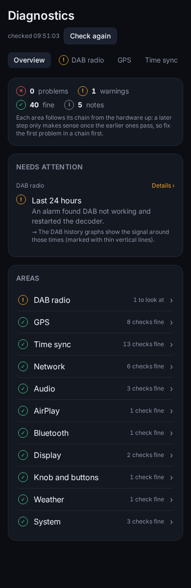
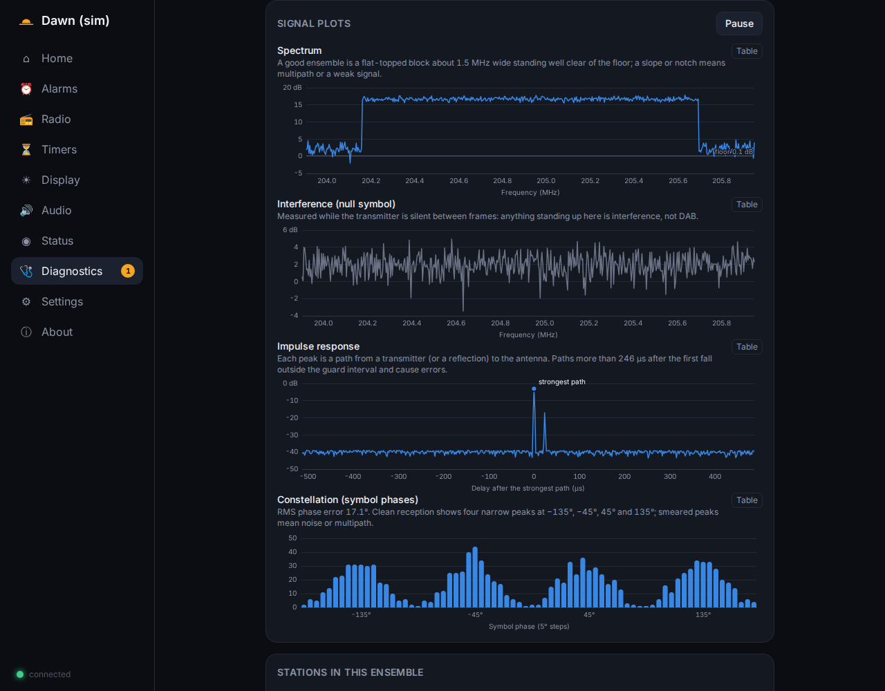
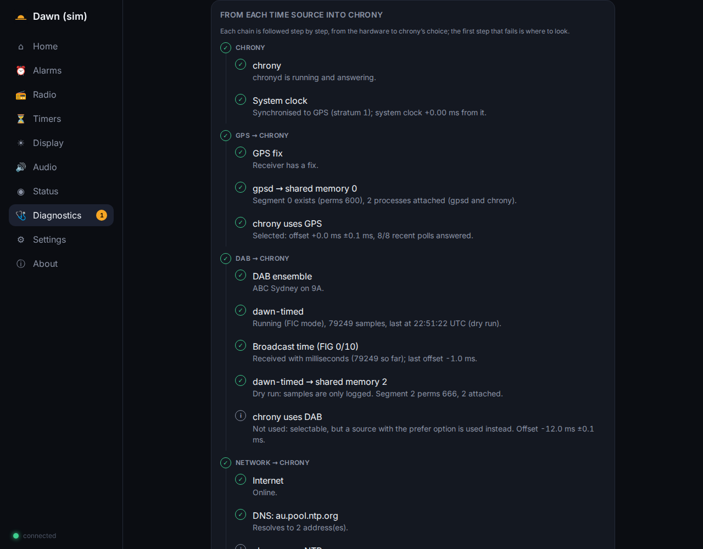

# Dawn

A bedside DAB+ alarm clock radio for Raspberry Pi: a 4.3" touch face, DAB+ via an
RTL-SDR, AirPlay 2 and Bluetooth, GPS/DAB/NTP-disciplined time, ambient-light
brightness, and a mobile control UI at `http://dawn.local:8080/`.


| Face states | Control UI |
|---|---|
|  |  |
|  |  |
|  |  |
|  |  |
|  |  |
|  |  |

| Diagnostics: DAB radio | Diagnostics: time sync |
|---|---|
|  |  |


More renders in [`docs/screenshots/`](docs/screenshots/). The face is one small design
system: the clock always sits top-right, a status line top-left says which mode is active
and whether audio is flowing, the middle is a 40/60 artwork/identity split, and a
persistent control bar runs along the bottom. Left alone while playing, the face becomes
an ambient clock with a now-playing strip (`display.ambient_after_s`); a tap brings the
player back. Standby sits on a soft procedural scene (sky, sun or moon, stars, clouds,
rain or snow, hills and trees) drawn from the current time relative to sunrise and sunset,
the weather feed and the season; it switches off in the night palette and can be disabled
with `display.scene`. At night the face goes into [sleep mode](#sleep-mode-and-burn-in): the
clock alone, small and amber on black, moving every couple of minutes. Anything that can go
wrong (DAB reception, GPS, each time source into chrony, network, audio, the Pi itself) is
checked and explained on the control UI's [Diagnostics](#troubleshooting) page, with live
readings, a week of history and one-tap fixes.

## Contents

- [Hardware](#hardware) · [Wiring](#wiring)
- [First boot](#first-boot) · [Updating](#updating)
- [Controls](#controls)
- [Laptop simulator](#laptop-simulator)
- [Architecture](#architecture) · [Configuration](#configuration)
- [Troubleshooting](#troubleshooting)
- [Development](#development) · [Acceptance checklist](docs/ACCEPTANCE.md)

## Hardware

Reference build. The whole clock runs from one 5 V USB-C supply; every part is
auto-detected at boot and the fallbacks stay supported:

| Part | Reference build | Fallbacks |
|---|---|---|
| Board | Raspberry Pi 4 B, Raspberry Pi OS Lite 64-bit (Oct 2026); passive heatsink, no fan | Pi 5 (22-pin DSI cable, 27 W PSU), Pi 3B+, Pi Zero 2 W (HyperPixel/HDMI only, low-CPU face) |
| Power | 5 V 3 A USB-C (KSA-15E-052300HA); ~7–8 W typical, ~13 W worst case | — |
| DAB+ | RTL-SDR Blog V4 (librtlsdr from the rtl-sdr-blog fork), on a short USB extension | any RTL2832U/R820T2 stick (tuner type logged) |
| GPS | u-blox 7 USB (VK-172 / VK-162), `/dev/ttyACM0`, NMEA 9600, no PPS | none (DAB and NTP time) |
| Display | Waveshare 4.3" DSI 43H-800480-IPS-CT, 800×480, Goodix touch over the ribbon, sysfs backlight 0–255 (`dtoverlay=vc4-kms-dsi-7inch`) | Pimoroni HyperPixel 4.0 Touch (DPI, PWM backlight); any HDMI panel (software dimmer) |
| Light sensor | PiicoDev VEML6030, I2C bus 1, 0x10, behind a window facing the room | VEML7700, BH1750; none (sunrise/sunset schedule) |
| Audio | Pimoroni Audio Amp SHIM (MAX98357A, I2S, mono ~2.5 W into 4 Ω; `--audio hifiberry`) → Dayton PC68-4 2.5" 4 Ω full-range in a ~0.5 L sealed box | USB DAC; HiFiBerry DAC/MiniAmp; 3.5 mm jack; HDMI |
| Inputs | touch (everything is on the screen) + Adafruit 377 bare rotary encoder with push switch (internal pull-ups) | optional big arcade button (off by default; GPIO, `gpiozero` + `lgpio`) |

The SHIM has no hardware volume and one channel, so Dawn does it in software: the
PipeWire filter chain mixes left and right to mono, high-passes at 110 Hz
(`audio.eq.highpass_hz`) and allows bass cuts but no boost (`audio.eq.bass_max_db`);
`audio.output_ceiling_percent` sets where volume 100 lands, so calibrate it on the device
to sit just below audible clipping (see [Calibrating the volume ceiling](#calibrating-the-volume-ceiling)).
Sink priority at boot is USB › I2S amp › headphone jack › HDMI; `--audio hifiberry`
pins the I2S amp (`audio.pinned_sink: hifiberry`) so a USB audio device plugged in later
cannot take over. Pin something else in *Audio* (web UI) or in the config.

## Wiring

BCM numbering. Input pins are configurable in `/etc/dawn/config.yaml` (`inputs:`). No
pins clash: the SHIM sits at the base of the 40-pin header and the other wires push onto
the pins above it.

| Header pin | BCM | Use | Part / wire |
|---|---|---|---|
| 1 | 3V3 | sensor power | VEML6030, red |
| 2, 4 | 5V | amp power | SHIM |
| 3 | GPIO2 (SDA) | I2C bus 1 | VEML6030, blue |
| 5 | GPIO3 (SCL) | I2C bus 1 | VEML6030, yellow |
| 9 | GND | sensor ground | VEML6030, black |
| 11 | GPIO17 | encoder A (CLK) | ADA377 outer pin |
| 13 | GPIO27 | encoder B (DT) | ADA377 other outer pin |
| 14 | GND | encoder common | ADA377 middle pin |
| 15 | GPIO22 | encoder switch | ADA377 switch pin |
| 20 | GND | encoder switch return | ADA377 other switch pin |
| 12 | GPIO18 | I2S bit clock | SHIM |
| 35 | GPIO19 | I2S LR clock | SHIM |
| 40 | GPIO21 | I2S data | SHIM |
| 22 | GPIO25 | driven high at boot (`gpio=25=op,dh`) | SHIM |
| 16 | GPIO23 | unused (big button not fitted) | — |
| — | DSI ribbon (~50 mm) | display power, video and touch I2C; no GPIO | Waveshare 43H |
| — | USB | RTL-SDR (short extension), GPS | |

The bare encoder has no pull-ups and no + pin: the A, B and switch pins are pulled up
inside the Pi and the contacts switch them to GND. It gives one volume step per detent
(24 per turn). If it turns the wrong way, swap the GPIO17 and GPIO27 wires or set
`inputs.encoder.invert: true`. Speaker leads are short, twisted and routed away from the
SDR antenna lead: the SHIM's output is unfiltered ~300 kHz PWM.

> HyperPixel 4 uses GPIO 0–25 for DPI, which also collides with the SHIM's I2S pins. With
> that panel use a USB DAC, and remap the encoder and button to free pins in `inputs:` —
> the installer prints a reminder.

> HyperPixel 4 uses GPIO 0–25 for DPI. With that panel, remap the encoder and
> button to the free pins (GPIO 26/27 or via the HyperPixel's breakout) in
> `inputs:` — the installer prints a reminder.

## First boot

1. Flash Raspberry Pi OS Lite (64-bit) and enable SSH and Wi-Fi in the imager.
2. On the Pi:
   ```bash
   sudo apt-get install -y git
   sudo git clone https://github.com/tunlezah/dawn /opt/dawn
   sudo /opt/dawn/deploy/install.sh --audio hifiberry   # the Audio Amp SHIM (omit for a USB DAC)
   sudo reboot
   ```
   The installer detects the board and display, writes the `config.txt`
   overlays, builds `rtl-sdr-blog`, `welle.io`, `shairport-sync` + `nqptp`,
   installs gpsd/chrony/PipeWire/BlueZ/cage/Chromium, creates the `dawn` user
   and enables the `dawn-core`, `dawn-dab`, `dawn-timed` and `dawn-face` units.
   It is idempotent; re-run it any time, and `--update` keeps the I2S amp set-up from an
   earlier install. Options: `--display`, `--audio`, `--data-device`, `--data-image-mb`,
   `--readonly`, `--no-build`, `--rebuild`.

   With `--audio hifiberry` the `config.txt` block gets `dtparam=audio=off`,
   `dtoverlay=hifiberry-dac` and `gpio=25=op,dh`; the mono filter chain
   (`deploy/pipewire/dawn-eq-mono.conf`) is installed; WirePlumber keeps the sink running
   while idle so the MAX98357A does not pop. The DSI panel gets `dtoverlay=vc4-kms-dsi-7inch`.
   If the case mounts the panel rotated, set `display.rotation` (90/180/270) in
   `/etc/dawn/config.yaml` and re-run the installer: it adds
   `video=DSI-1:800x480M@60,rotate=…` to `cmdline.txt` and a matching libinput touch
   calibration matrix (`/etc/udev/rules.d/98-dawn-touch.rules`), then reboot.
3. The face reaches standby within about 40 s. Without a network it starts a
   setup hotspot and shows its SSID, password and a Wi-Fi QR code; join it and
   open `http://10.42.0.1:8080/` to pick a Wi-Fi network.
4. Open `http://dawn.local:8080/` (core listens on port 8080; nothing answers on 80):
   - **Radio → Scan** to find DAB+ ensembles (Australian capital channels first),
     star stations as presets.
   - **Alarms → Add**.
   - **Settings** for location (or let the GPS fill it), holiday state, time
     zone, name, PIN, backups and updates. *All options* edits any config value.

### Calibrating the volume ceiling

The amp's gain is fixed, so where clipping starts depends on the build. With the case
closed: set `audio.output_ceiling_percent: 100`, play loud, bass-heavy music at volume
100, and lower the ceiling in steps of 5 (*Settings → All options → audio*) until the
distortion goes away; then confirm an alarm
at volume 100 is clearly loud enough at 1 m. Every path — the controls, alarm ramps,
chimes, the sleep fade — scales into that ceiling; `audio.max_volume` additionally caps
the 0–100 scale itself.

## Updating

- From the UI: *Settings → Software update → Update now* (`git pull` + `install.sh --update`, services restart).
- From a laptop: `make deploy HOST=dawn.local` builds the web UI and rsyncs the repo.
- On the Pi: `cd /opt/dawn && sudo git pull && sudo ./deploy/install.sh --update`.

## Controls

Never ambiguous; snooze and stop are never on the same control. Touch does everything;
the encoder is fitted on the reference build, and the big button is optional (off unless
`inputs.big_button.enabled`); both keep their jobs when fitted.

| Control | Ringing | Playing | Standby |
|---|---|---|---|
| Tap the screen | **snooze** | menu sheet; from the ambient clock: back to the player | menu sheet |
| Hold the screen 2 s | **stop** | — | — |
| Menu sheet | — | Presets · Nap · Sleep · Brightness · **Standby**, and a volume slider (mute on the speaker) | same, with **Radio on** (first preset) in place of Standby |
| Standby tile, hold 3 s | — | safe shutdown with on-screen countdown (release to cancel) | same, on the Radio on tile |
| Control bar | — | ◀◀ ❚❚ ▶▶ for AirPlay/Bluetooth, ◀ ☆ ▶ (preset prev / star / next) for radio | — |
| Big button, short | **stop** | stop playback → standby | wake face to full for 20 s |
| Big button, hold 3 s | safe shutdown with on-screen countdown (release to cancel) | | |
| Encoder rotate | volume (steps of 2, overlay 1.5 s) | volume | volume |
| Encoder push | **snooze** | next preset | first preset |
| Encoder hold | — | nap-timer picker | nap-timer picker |

The menu is a sheet that slides up over the bottom of the screen; the clock and what is
playing stay visible above it. It closes on a tap outside it or after
`inputs.touch_menu_timeout_s` (15 s) without a touch; a finger on the slider or a tile holds
it open. Volume only appears with the sheet rather than sitting in the control bar. The
Standby tile *is* the big button: a tap is its short press and a hold is the same shutdown
countdown, so a clock with the button fitted and one without behave the same.

### Sleep mode and burn-in

In Standby at night the face shows the clock alone: small, deep amber on black at the lowest
backlight, with the next alarm and a weather icon under it, fading to a new place every two
minutes. Set it under *Display → Sleep mode* (`display.sleep`):

- **Goes to sleep** at the bedtime (22:30) *or* when the room goes dark (below 3 lx for a
  minute) — each on its own switch.
- **Wakes** at the morning time (06:30), 10 minutes before the next alarm (or its light wake),
  or when the room gets bright — whichever comes first. An alarm ringing always wakes it.
- Playing audio stays on screen until it stops; then the sleep clock takes over.
- A tap shows the full face, dimmed to 15 %, for `inputs.standby_wake_s`; a second tap opens
  the menu. With *Screen off* the backlight is off on a black screen and the first tap shows
  the sleep clock for 10 s.
- *Sleep now* / *Wake now* hold until the next bedtime, morning, alarm or change of light.

The panel is an IPS LCD, so the risk is image retention from things that never move. Besides
the moving sleep clock: the face's text drifts a few pixels over time (pixel orbit), the
Standby status strip fades after two minutes without a touch, and the background's hills and
trees are redrawn from the date each day (*Display → Burn-in protection*, `display.burn_in`).

## Laptop simulator

```bash
make setup     # .venv + editable installs + npm install
make sim       # simulators + core + dawn-timed; web UI on http://localhost:8080
```

- Face: http://localhost:8080/face · Control UI: http://localhost:8080/
- Sim hub (lux slider, GPS/DAB/SDR/network toggles, phone buttons for AirPlay and
  Bluetooth, encoder/button/touch, and faults for *Diagnostics*: DAB SNR, GPS signal,
  GPS unplugged, Wi-Fi level, failed services): http://localhost:8099/
- Sleep mode is off in the simulator's config so the tests do not depend on the hour;
  turn it on under *Display → Sleep mode*.
- Keyboard in the `make sim` terminal: `+`/`-` volume, Enter encoder push, `n`
  encoder hold, Space big button, `S` hold, `t` touch, `1`–`9` lux presets,
  `g` GPS, `d` DAB sync, `u` SDR plug, `w` network, `q` quit.
- Background mode for tests: `scripts/simctl.sh start|stop|restart|status`.

The fake welle-cli serves a canned Sydney ensemble set (channels 9A/9B/9C) with
DLS and MOT slides, the fake gpsd speaks the real JSON protocol, and the hub
serves a canned Open-Meteo forecast, so no internet is needed.

## Architecture

```
core/        dawn-core: FastAPI + uvicorn, SQLite (SQLModel), one systemd service
             state store → WebSocket pushes the full UI state on every change
             audio arbiter (alarm > sleep > user > AirPlay > Bluetooth), alarm engine,
             inputs, display/brightness, DAB (welle-cli client), time sources, weather,
             network/hotspot, AirPlay (shairport metadata), Bluetooth (BlueZ D-Bus)
web/         Vite + React + TS + Tailwind; two targets: control UI (/) and face (/face)
dawn-timed/  DAB+ ensemble time (welle-cli utctime or FIG 0/10 from /fic) → chrony SHM 2
sim/         GPS/NMEA + fake gpsd, fake welle-cli, lux, inputs, backlight, phones, weather
deploy/      install.sh, systemd units, udev, chrony, gpsd, PipeWire/WirePlumber,
             shairport-sync, sudoers, polkit, logrotate, avahi, kiosk/update scripts
config/      config.example.yaml (generated from the schema), config.sim.yaml
```

Time: gpsd → `SHM 0` (prefer, trust), dawn-timed → `SHM 2` (DAB), `au.pool.ntp.org`;
chrony `makestep 1 3`. The face shows a dot per source (green live, grey stale).
Alarms are evaluated against the system clock only and remember the last
occurrence they handled, so a clock step never double-fires or skips one.

Audio: PipeWire + WirePlumber in the `dawn` user session; mpv per source family
(`dawn-dab`, `dawn-media`, `dawn-chime`); a filter-chain sink (mono mix for the SHIM,
110 Hz high-pass, two-band EQ); master volume in software on the hardware sink, scaled
into `audio.output_ceiling_percent`; "audio flowing" from stream state → chime fallback
after 15 s.

## Configuration

`/etc/dawn/config.yaml` (validated by pydantic, hot-reloaded on change; schema at
`/api/config/schema`). The full commented reference is
[`config/config.example.yaml`](config/config.example.yaml). Runtime state
(alarms, presets, scan results, volume, brightness mode) lives in
`/var/lib/dawn/dawn.db`. Backup/restore of both as one JSON: *Settings*.

REST API docs: `http://dawn.local:8080/api/docs`. Everything the UIs do goes through it.

## Troubleshooting

Start with **Diagnostics** in the control UI (`http://dawn.local:8080/diagnostics`; on a phone
under *More*). It checks every link from the hardware up, lists problems first with what to do,
and offers the fixes that are safe to run from a browser (restart a service, rescan, retune,
set the tuner gain, poll the time sources, play a test tone):

- **DAB radio**: SNR once a second with a two-minute trace, data-channel (FIC) errors,
  frequency correction, the spectrum, interference measured in the null symbol, the impulse
  response (multipath and the transmitters reaching you), the symbol phases, error rates of the
  station playing, transmitters heard (TII), and the decoder's options and messages.
- **GPS**: fix, satellites in view and used, a sky plot, the signal per satellite, HDOP, and how
  late the receiver's time report arrives.
- **Time sync**: GPS → chrony, DAB → chrony (welle-cli → dawn-timed → FIG 0/10 → shared memory 2)
  and Network → chrony (internet → DNS → NTP replies) step by step, with chrony's own reason
  when a source is not used.
- **Network**, **Audio & devices**, **System**: the rest, plus services, power, disk and logs.
- Every tab keeps a week of history, so an overnight dropout can be looked at in the morning.

| Symptom | Check |
|---|---|
| Face stays black | `journalctl -u dawn-face -f`; `systemctl status dawn-core`; HDMI panels need `--display hdmi`; DSI needs `dtoverlay=vc4-kms-v3d` and, for the 43H panel, `dtoverlay=vc4-kms-dsi-7inch` (not `vc4-kms-dsi-waveshare-panel`) |
| Touch is offset or mirrored | `display.rotation` matches the case and the installer was re-run (`/etc/udev/rules.d/98-dawn-touch.rules`) |
| No DAB stations after a scan | *Diagnostics → DAB radio* (stick, TV driver, decoder, sync, SNR); `rtl_test -t` (tuner type), `systemctl status dawn-dab`, `curl localhost:8000/mux.json`; blacklist `dvb_usb_rtl28xxu` is written by the installer; antenna/Band III coverage |
| DAB drops out or bubbles | *Diagnostics → DAB radio*: SNR below ~8 dB, FIC errors, decode errors; the spectrum should be a flat block ~1.5 MHz wide, the impulse response one main peak; try a fixed tuner gain a few steps below the AGC's choice near a strong transmitter, and move the antenna away from the Pi and the panel |
| Alarm rings the chime instead of the station | expected after 15 s without audio (SDR unplugged, no sync); *Diagnostics → DAB radio → Last 24 hours* and the history graphs show the signal at that time |
| No sound | *Audio* page: sink list and active sink; `wpctl status` as user dawn (`sudo -u dawn XDG_RUNTIME_DIR=/run/user/$(id -u dawn) wpctl status`); with the SHIM, `aplay -l` should list `snd_rpi_hifiberry_dac` and `config.txt` must have `gpio=25=op,dh` |
| Pop when audio starts or stops | `/etc/wireplumber/wireplumber.conf.d/52-dawn-alsa.conf` present; `wpctl inspect` on the hardware sink shows `session.suspend-timeout-seconds = 0` |
| Only one side of a stereo track | the mono filter chain is not loaded: re-run `install.sh --audio hifiberry` and check `/etc/pipewire/pipewire.conf.d/dawn-eq.conf` says "mono" |
| Distortion at high volume | lower `audio.output_ceiling_percent`; keep `audio.eq.bass_max_db` at 0 |
| Random resets, SD errors, *Status → Hardware → Power and throttling* warns | `vcgencmd get_throttled`: bit 0x10000 = under-voltage since boot; use the 5 V 3 A supply directly, no hub |
| Time not synced | *Diagnostics → Time sync* (the first failing step in each chain); `chronyc sources -v`; `gpsd` on `/dev/gps0`; `ipcs -m` shows SHM 0 and 2 |
| No GPS fix | *Diagnostics → GPS*: satellites heard and their signal (four or more above 30 dBHz for a reliable fix), the sky plot shows what the window or walls block |
| Brightness does not react | *Status → Hardware → Light sensor*; `i2cdetect -y 1` (0x10/0x48); without a sensor the schedule is used |
| AirPlay missing on the phone | `systemctl status shairport-sync nqptp`; same subnet; name in *Audio → AirPlay* |
| Bluetooth will not pair | *Audio → Bluetooth → Pair new device* (discoverable 3 min); `bluetoothctl show`; user dawn in group `bluetooth` |
| Wi-Fi lost | the setup hotspot appears after 45 s; *Settings → Wi-Fi* |
| Watchdog reboots | `journalctl -b -1 -u dawn-core`; the heartbeat is `/run/dawn/heartbeat` |

Logs: `journalctl -u dawn-core -u dawn-dab -u dawn-timed -u dawn-face -f`, also
*Diagnostics → System → Logs* in the UI. Installer log: `/var/log/dawn-install.log`.

## Development

```bash
make test          # pytest (core, dawn-timed): scheduling/DST/holidays, arbiter, brightness, parsers…
make lint          # ruff + tsc
make web-build     # web/dist (both targets)
make e2e           # Playwright smoke tests against a running simulator
make screenshots   # docs/screenshots/*.png from the simulator
make gen-config    # regenerate config/config.example.yaml from the schema
make deploy HOST=dawn.local
```

Decisions are recorded in [`DECISIONS.md`](DECISIONS.md); changes in
[`CHANGELOG.md`](CHANGELOG.md); the acceptance checklist with verification
steps in [`docs/ACCEPTANCE.md`](docs/ACCEPTANCE.md).
