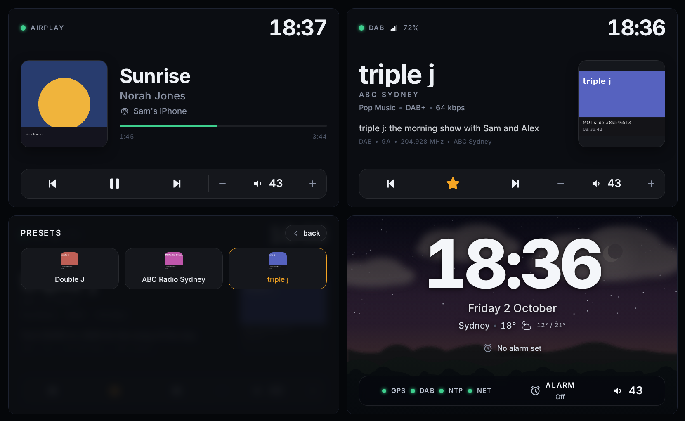
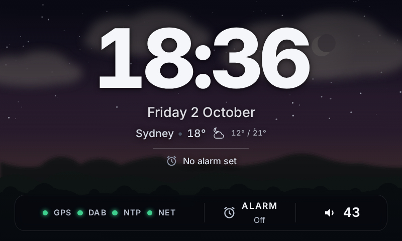
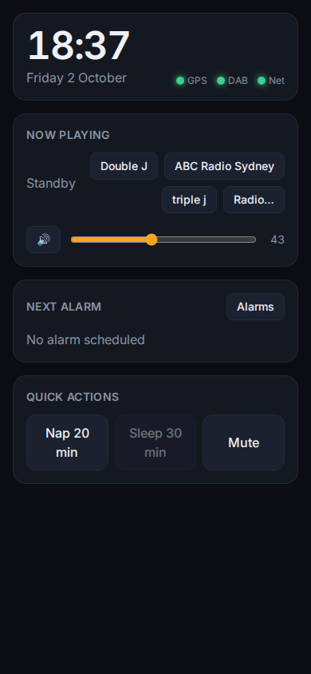
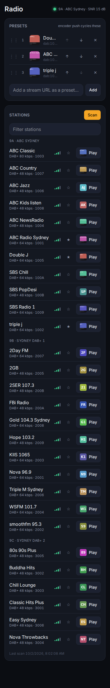
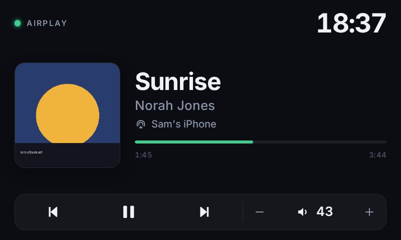
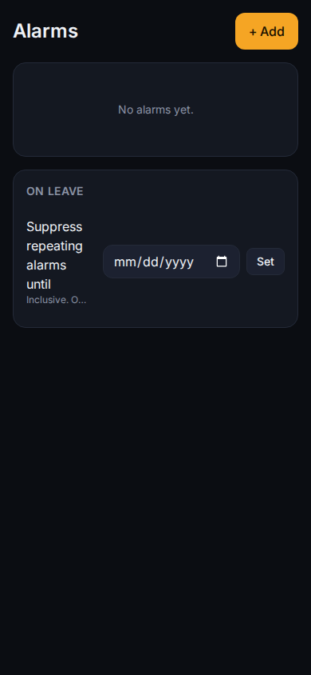
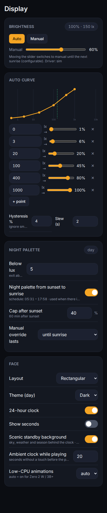
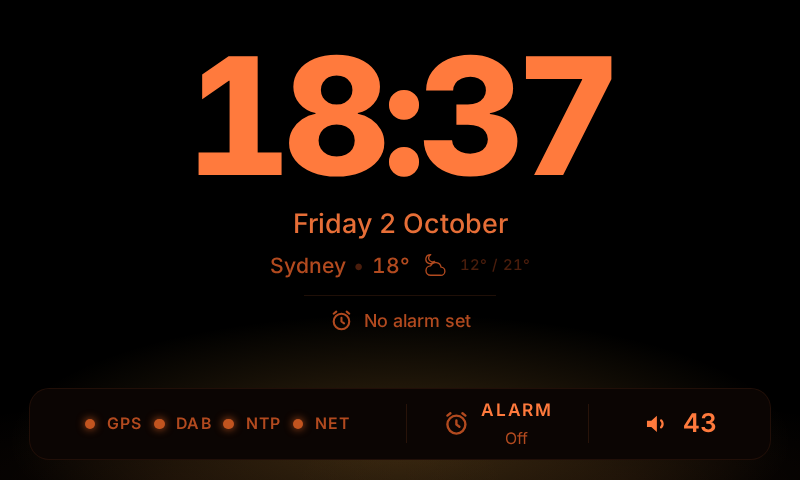
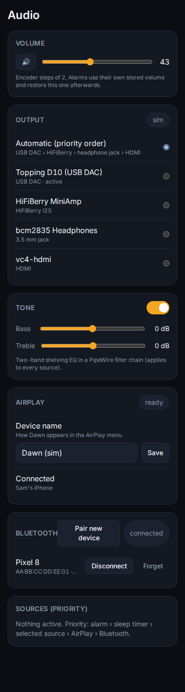
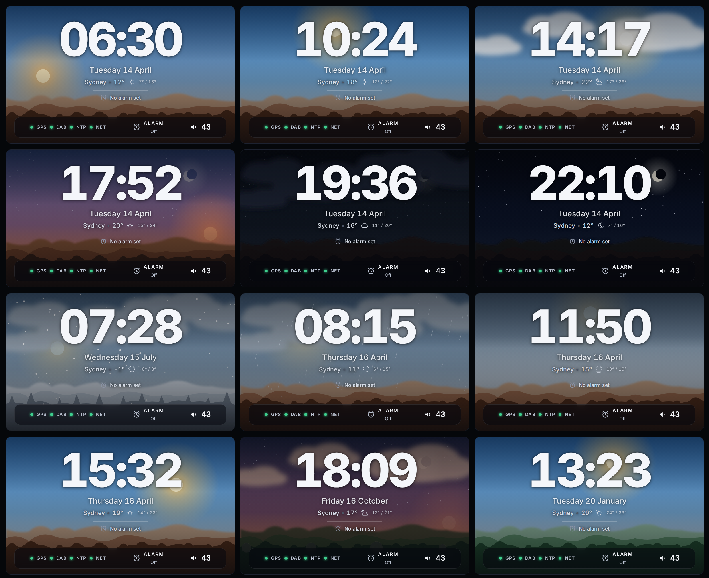

# Dawn

A bedside DAB+ alarm clock radio for Raspberry Pi: a 4.3" touch face, DAB+ via an
RTL-SDR, AirPlay 2 and Bluetooth, GPS/DAB/NTP-disciplined time, ambient-light
brightness, and a mobile control UI at `http://dawn.local/`.



| Face states | Control UI |
|---|---|
|  |  |
|  |  |
|  |  |
|  |  |
|  |  |



More renders in [`docs/screenshots/`](docs/screenshots/). The face is one small design
system: the clock always sits top-right, a status line top-left says which mode is active
and whether audio is flowing, the middle is a 40/60 artwork/identity split, and a
persistent control bar runs along the bottom. Left alone while playing, the face becomes
an ambient clock with a now-playing strip (`display.ambient_after_s`); a tap brings the
player back. Standby sits on a soft procedural scene (sky, sun or moon, stars, clouds,
rain or snow, hills and trees) drawn from the current time relative to sunrise and sunset,
the weather feed and the season; it switches off in the night palette and can be disabled
with `display.scene`.

## Contents

- [Hardware](#hardware) · [Wiring](#wiring)
- [First boot](#first-boot) · [Updating](#updating)
- [Controls](#controls)
- [Laptop simulator](#laptop-simulator)
- [Architecture](#architecture) · [Configuration](#configuration)
- [Troubleshooting](#troubleshooting)
- [Development](#development) · [Acceptance checklist](docs/ACCEPTANCE.md)

## Hardware

Primary build (all parts auto-detected at boot; every fallback is supported):

| Part | Primary | Fallbacks |
|---|---|---|
| Board | Raspberry Pi 4 B, Raspberry Pi OS (Oct 2026, lite, 64-bit) | Pi 5, Pi 3B+, Pi Zero 2 W (HyperPixel/HDMI only, low-CPU face) |
| DAB+ | RTL-SDR Blog V4 (librtlsdr from the rtl-sdr-blog fork) | any RTL2832U/R820T2 stick (tuner type logged) |
| GPS | u-blox 7 USB (VK-172 / VK-162), `/dev/ttyACM0`, NMEA 9600, no PPS | none (DAB and NTP time) |
| Display | Waveshare 4.3" DSI capacitive touch, 800×480, sysfs backlight | Pimoroni HyperPixel 4.0 Touch (DPI, PWM backlight); any HDMI panel (software dimmer) |
| Light sensor | PiicoDev VEML6030, I2C bus 1, 0x10 (0x48 jumper cut) | VEML7700, BH1750; none (sunrise/sunset schedule) |
| Audio | USB DAC (UAC) → class-D amp | HiFiBerry MiniAmp (`dtoverlay=hifiberry-dac`); 3.5 mm jack; HDMI |
| Inputs | KY-040 encoder + big arcade button (GPIO, `gpiozero` + `lgpio`) | touch only |

Sink priority at boot is USB DAC › HiFiBerry › headphone jack › HDMI; pin one in
*Audio* (web UI) or `audio.pinned_sink` in the config.

## Wiring

BCM numbering. All pins are configurable in `/etc/dawn/config.yaml` (`inputs:`).

| Signal | Pin | Header | Note |
|---|---|---|---|
| Encoder CLK (A) | GPIO17 | 11 | KY-040 |
| Encoder DT (B) | GPIO27 | 13 | |
| Encoder SW (push) | GPIO22 | 15 | push = snooze / select |
| Encoder + / GND | 3V3 / GND | 1 / 9 | |
| Big "off" button | GPIO23 ↔ GND | 16 / 14 | internal pull-up |
| VEML6030 SDA / SCL | GPIO2 / GPIO3 | 3 / 5 | 3V3, GND; address 0x10 |
| HiFiBerry MiniAmp | HAT header (I2S) | — | optional |
| HyperPixel 4 backlight | GPIO19 (PWM) | 35 | only with HyperPixel |
| RTL-SDR, GPS | USB | — | |
| Waveshare 4.3" DSI | DSI ribbon | — | backlight under `/sys/class/backlight/` |

> HyperPixel 4 uses GPIO 0–25 for DPI. With that panel, remap the encoder and
> button to the free pins (GPIO 26/27 or via the HyperPixel's breakout) in
> `inputs:` — the installer prints a reminder.

## First boot

1. Flash Raspberry Pi OS Lite (64-bit) and enable SSH and Wi-Fi in the imager.
2. On the Pi:
   ```bash
   sudo apt-get install -y git
   sudo git clone https://github.com/tunlezah/dawn /opt/dawn
   sudo /opt/dawn/deploy/install.sh            # add --audio hifiberry for the MiniAmp
   sudo reboot
   ```
   The installer detects the board and display, writes the `config.txt`
   overlays, builds `rtl-sdr-blog`, `welle.io`, `shairport-sync` + `nqptp`,
   installs gpsd/chrony/PipeWire/BlueZ/cage/Chromium, creates the `dawn` user
   and enables the `dawn-core`, `dawn-dab`, `dawn-timed` and `dawn-face` units.
   It is idempotent; re-run it any time. Options: `--display`, `--audio`,
   `--data-device`, `--data-image-mb`, `--readonly`, `--no-build`, `--rebuild`.
3. The face reaches standby within about 40 s. Without a network it starts a
   setup hotspot and shows its SSID, password and a Wi-Fi QR code; join it and
   open `http://10.42.0.1/` to pick a Wi-Fi network.
4. Open `http://dawn.local/`:
   - **Radio → Scan** to find DAB+ ensembles (Australian capital channels first),
     star stations as presets.
   - **Alarms → Add**.
   - **Settings** for location (or let the GPS fill it), holiday state, time
     zone, name, PIN, backups and updates. *All options* edits any config value.

## Updating

- From the UI: *Settings → Software update → Update now* (`git pull` + `install.sh --update`, services restart).
- From a laptop: `make deploy HOST=dawn.local` builds the web UI and rsyncs the repo.
- On the Pi: `cd /opt/dawn && sudo git pull && sudo ./deploy/install.sh --update`.

## Controls

Never ambiguous; snooze and stop are never on the same control.

| Control | Ringing | Playing | Standby |
|---|---|---|---|
| Big button, short | **stop** | stop playback → standby | wake face to full for 20 s |
| Big button, hold 3 s | safe shutdown with on-screen countdown (release to cancel) | | |
| Encoder rotate | volume (steps of 2, overlay 1.5 s) | volume | volume |
| Encoder push | **snooze** | next preset | first preset |
| Encoder hold | — | nap-timer picker | nap-timer picker |
| Control bar (touch) | — | ◀◀ ❚❚ ▶▶ for AirPlay/Bluetooth, ◀ ☆ ▶ (preset prev / star / next) for radio, − 🔊 + | — |
| Touch anywhere else | **snooze** | menu (presets, nap, sleep, brightness); from the ambient clock: back to the player | menu |

## Laptop simulator

```bash
make setup     # .venv + editable installs + npm install
make sim       # simulators + core + dawn-timed; web UI on http://localhost:8080
```

- Face: http://localhost:8080/face · Control UI: http://localhost:8080/
- Sim hub (lux slider, GPS/DAB/SDR/network toggles, phone buttons for AirPlay and
  Bluetooth, encoder/button/touch): http://localhost:8099/
- Keyboard in the `make sim` terminal: `+`/`-` volume, Enter encoder push, `n`
  encoder hold, Space big button, `S` hold, `t` touch, `1`–`9` lux presets,
  `g` GPS, `d` DAB sync, `u` SDR plug, `w` network, `q` quit.
- Background mode for tests: `scripts/simctl.sh start|stop|restart|status`.

The fake welle-cli serves a canned Sydney ensemble set (channels 9A/9B/9C) with
DLS and MOT slides, the fake gpsd speaks the real JSON protocol, and the hub
serves a canned Open-Meteo forecast, so no internet is needed.

## Architecture

```
core/        dawn-core: FastAPI + uvicorn, SQLite (SQLModel), one systemd service
             state store → WebSocket pushes the full UI state on every change
             audio arbiter (alarm > sleep > user > AirPlay > Bluetooth), alarm engine,
             inputs, display/brightness, DAB (welle-cli client), time sources, weather,
             network/hotspot, AirPlay (shairport metadata), Bluetooth (BlueZ D-Bus)
web/         Vite + React + TS + Tailwind; two targets: control UI (/) and face (/face)
dawn-timed/  DAB+ ensemble time (welle-cli utctime or FIG 0/10 from /fic) → chrony SHM 2
sim/         GPS/NMEA + fake gpsd, fake welle-cli, lux, inputs, backlight, phones, weather
deploy/      install.sh, systemd units, udev, chrony, gpsd, PipeWire/WirePlumber,
             shairport-sync, sudoers, polkit, logrotate, avahi, kiosk/update scripts
config/      config.example.yaml (generated from the schema), config.sim.yaml
```

Time: gpsd → `SHM 0` (prefer, trust), dawn-timed → `SHM 2` (DAB), `au.pool.ntp.org`;
chrony `makestep 1 3`. The face shows a dot per source (green live, grey stale).
Alarms are evaluated against the system clock only and remember the last
occurrence they handled, so a clock step never double-fires or skips one.

Audio: PipeWire + WirePlumber in the `dawn` user session; mpv per source family
(`dawn-dab`, `dawn-media`, `dawn-chime`); two-band EQ as a filter-chain sink;
"audio flowing" from stream state → chime fallback after 15 s.

## Configuration

`/etc/dawn/config.yaml` (validated by pydantic, hot-reloaded on change; schema at
`/api/config/schema`). The full commented reference is
[`config/config.example.yaml`](config/config.example.yaml). Runtime state
(alarms, presets, scan results, volume, brightness mode) lives in
`/var/lib/dawn/dawn.db`. Backup/restore of both as one JSON: *Settings*.

REST API docs: `http://dawn.local/api/docs`. Everything the UIs do goes through it.

## Troubleshooting

| Symptom | Check |
|---|---|
| Face stays black | `journalctl -u dawn-face -f`; `systemctl status dawn-core`; HDMI panels need `--display hdmi`; DSI needs `dtoverlay=vc4-kms-v3d` |
| No DAB stations after a scan | `rtl_test -t` (tuner type), `systemctl status dawn-dab`, `curl localhost:8000/mux.json`; blacklist `dvb_usb_rtl28xxu` is written by the installer; antenna/Band III coverage |
| Alarm rings the chime instead of the station | expected after 15 s without audio (SDR unplugged, no sync); see *Status → Logs* (`ring_fallback`) |
| No sound | *Audio* page: sink list and active sink; `wpctl status` as user dawn (`sudo -u dawn XDG_RUNTIME_DIR=/run/user/$(id -u dawn) wpctl status`) |
| Time not synced | *Status → Time*; `chronyc sources -v`; `gpsd` on `/dev/gps0`; `ipcs -m` shows SHM 0 and 2 |
| Brightness does not react | *Status → Hardware → Light sensor*; `i2cdetect -y 1` (0x10/0x48); without a sensor the schedule is used |
| AirPlay missing on the phone | `systemctl status shairport-sync nqptp`; same subnet; name in *Audio → AirPlay* |
| Bluetooth will not pair | *Audio → Bluetooth → Pair new device* (discoverable 3 min); `bluetoothctl show`; user dawn in group `bluetooth` |
| Wi-Fi lost | the setup hotspot appears after 45 s; *Settings → Wi-Fi* |
| Watchdog reboots | `journalctl -b -1 -u dawn-core`; the heartbeat is `/run/dawn/heartbeat` |

Logs: `journalctl -u dawn-core -u dawn-dab -u dawn-timed -u dawn-face -f`, also
*Status → Logs* in the UI. Installer log: `/var/log/dawn-install.log`.

## Development

```bash
make test          # pytest (core, dawn-timed): scheduling/DST/holidays, arbiter, brightness, parsers…
make lint          # ruff + tsc
make web-build     # web/dist (both targets)
make e2e           # Playwright smoke tests against a running simulator
make screenshots   # docs/screenshots/*.png from the simulator
make gen-config    # regenerate config/config.example.yaml from the schema
make deploy HOST=dawn.local
```

Decisions are recorded in [`DECISIONS.md`](DECISIONS.md); changes in
[`CHANGELOG.md`](CHANGELOG.md); the acceptance checklist with verification
steps in [`docs/ACCEPTANCE.md`](docs/ACCEPTANCE.md).
