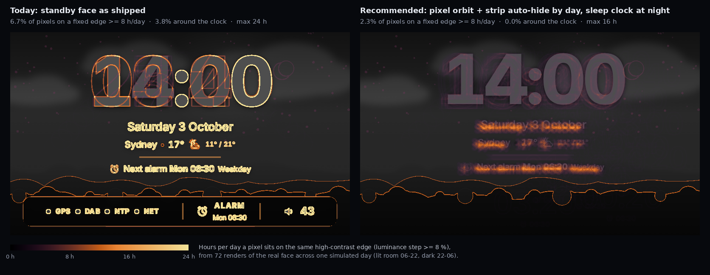
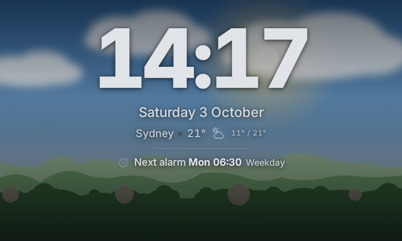
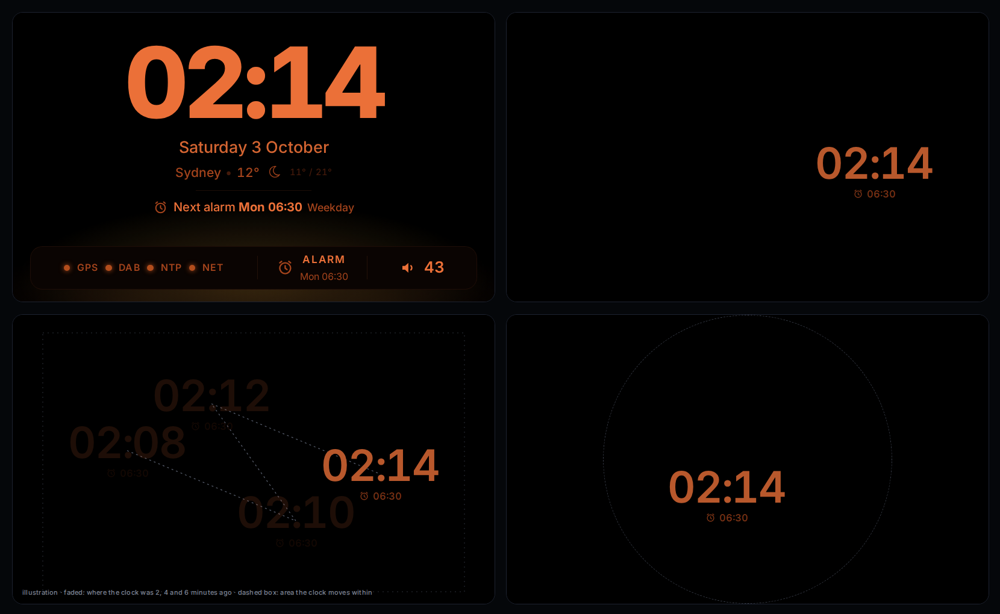
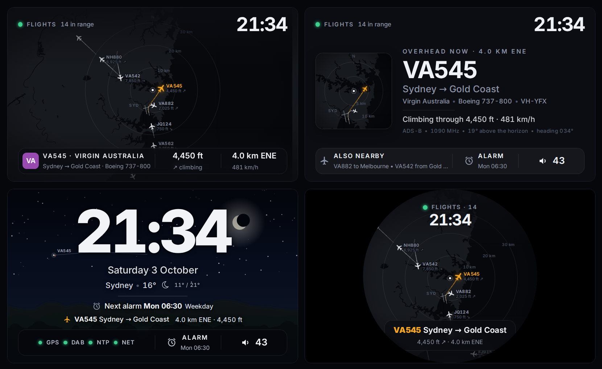
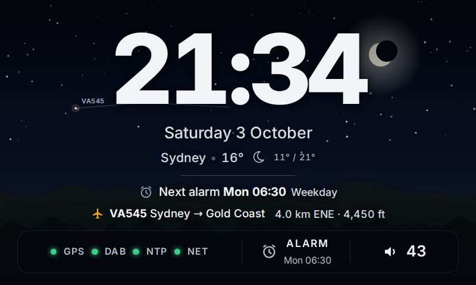
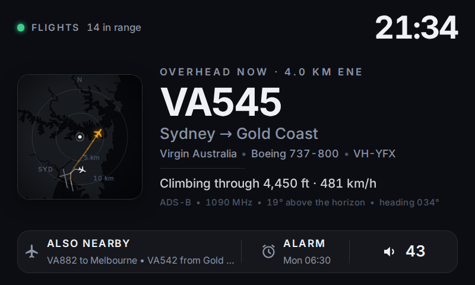
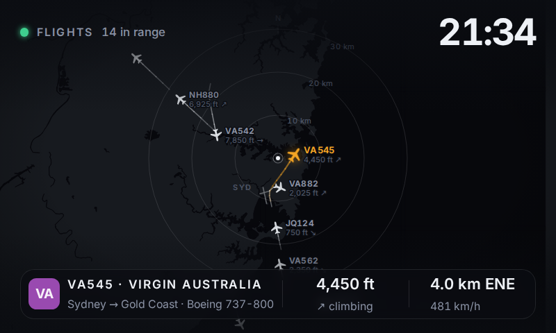

# Standby display research: burn-in, sleep mode, flight tracking

Research only: nothing in the product changed. October 2026.

Every render below comes from the simulator using the face's own compiled CSS, so the mockups sit
next to [`docs/screenshots/`](../screenshots/) without a second design system. The flight mockups use a
real ADS-B snapshot of Sydney (Saturday 3 October 2026, 21:34 AEST) around the default config location.
How to regenerate everything is in the [appendix](#appendix-method-data-and-licences).

## Summary

| Question | Short answer | Recommendation |
|---|---|---|
| **1. Burn-in** | Both supported touch panels are IPS LCDs, so the risk is *image retention* (a ghost that usually fades), not permanent OLED burn-in. But the standby face holds the same high-contrast pattern on 3.8 % of the panel 24 hours a day (status strip, colon, date and alarm lines), which is exactly what retention needs. | Pixel orbit plus a status strip that hides itself by day, the sleep clock at night, and a scene that changes daily. In a simulated day nothing then stays on a fixed edge for more than 16 h (today: 24 h). Small, face-side work. |
| **2. Sleep mode** | Yes. At the backlight floor, a small deep-amber clock jumps to a new spot every 2 minutes with a short fade. It gives off about 6 % of the light of today's night face at the same backlight setting. It is also the biggest single burn-in fix. | Build it. Core decides when, the face draws it. Fix the full-brightness wake tap at night at the same time. |
| **3. Flight tracking** | Feasible on the existing RTL-SDR, and ADS-B decoding is lighter work than DAB. Sharing one dongle works, but it touches alarms, DAB time and scans, and a DAB antenna is a poor 1090 MHz antenna. | Prototype the screens first on network data (the same JSON readsb writes). Then pick either a second dongle (simplest) or time-sharing (no new hardware, more logic). Default to the quiet *ambient* view, with the radar on a tap. |

---

## 1. Burn-in

### 1.1 What this panel actually risks

- **The panels are LCD, not OLED.** The Waveshare 4.3" DSI is sold as an 800×480 "IPS wide angle" panel
  ([Waveshare](https://www.waveshare.com/4.3inch-dsi-lcd.htm)). The HyperPixel 4.0 is a 4.0" IPS panel
  ([Pimoroni](https://shop.pimoroni.com/products/hyperpixel-4)). Both have LED backlights.
- **LCDs don't burn in; they get image retention.** In an OLED, the light emitters themselves wear out
  unevenly, and that is permanent. In an LCD, a small DC offset on each pixel makes free ions in the
  liquid crystal drift and stick to the alignment layers. That leaves a faint ghost of a pattern that was
  held for hours. Ions are trapped over roughly 10 minutes to several hours of driving and released
  over seconds to tens of minutes ([Xu et al., J. Appl. Phys. 2014, with AU Optronics](https://api.creol.ucf.edu/Publications/9309.pdf)).
  So the ghost usually fades, but left untreated it can become permanent
  ([image persistence](https://en.wikipedia.org/wiki/Image_persistence)).
- **What makes it worse:** the same static image for hours, high-contrast neighbouring areas, and heat
  ([Sharp/NEC](https://ik.imagekit.io/pimberly/65707b38e31f5a94719d7ba0/6a11c2b2/65f86de6dc7477001863a1d6/mmo_113230909_1700469715_4161_5744.pdf)).
  Vendor rules of thumb:
  - Dell sees retention after more than 12 h of a static image, and recovers it by switching off for 24 h
    ([Dell](https://www.dell.com/support/kbdoc/en-bz/000328492/lcd-image-retention-or-burn-in-on-latitude-detachable)).
  - Orient Display says keep static images under 2 h
    ([Tech Briefs](https://www.techbriefs.com/component/content/article/39822-image-sticking-cause-test-and-solutions)).
  - A bedside clock that shows one layout all day breaks all of these by a wide margin.
- **Turning the backlight off does not help.** The liquid-crystal cells are still driven with the same
  frame, so the ghost keeps building in the dark. Backlight brightness matters only through the heat it
  adds. Three things do rest the cells:
  - changing what is shown
  - a uniform black frame (IPS is black when undriven)
  - powering the panel down

  The vendors all prescribe power-off or standby, not dimming.
- **HDMI fallback panels may be OLED.** There the damage is real and permanent, and the same mitigations
  matter more.

**What the display industry does about it:**

- **Samsung signage:** Pixel Shift of 0–4 px on each axis every 1–4 minutes. Samsung's "optimum" is
  4 px / 4 px / 4 min. A screen saver also starts after 2–10 h of static content
  ([manual](https://inquirecontent2.ingrammicro.com/User-Manual/1059378728.pdf)).
- **LG signage ("ISM method"):**
  - *Orbiter*, which moves the picture by about 3–4 px in a fixed order.
  - *White wash*, *colour wash* and *inversion*, which clear a ghost that has already formed
    ([manual](https://manualslib.mx/manual/563119/Lg-49Xs2B.html?page=178)).
- **NEC / Sharp:**
  - A "motion" saver and 6–8 h a day powered off.
  - "Showing a different content for a few seconds will not help… best effects when different contents are
    shown for an equal period" ([manual](https://www.manualslib.mx/manual/102776/Nec-Multeos-M40.html?page=36)).
- **Android always-on display (OLED):**
  - It moves the clock up to 8 dp horizontally and about 42–50 dp vertically.
  - The moves follow slow triangle waves (83 and 521 minute periods), recomputed every minute
    ([`BurnInHelper.kt`](https://android.googlesource.com/platform/frameworks/base/+/refs/heads/main/packages/SystemUI/src/com/android/systemui/doze/util/BurnInHelper.kt)).
  - A 4 px shift only softens the edges of thick clock strokes; the inside of each stroke stays put. So
    the further and slower a clock moves, the better.

### 1.2 Where Dawn's face is static today

I rendered the real standby face from the simulator every 20 minutes across one simulated day:
- 06:00–22:00 in a lit room: dark theme with the scene.
- 22:00–06:00 in the dark: the night palette.

For each pixel, I added up the hours spent on a high-contrast edge (a luminance step of 8 % or more). An
LCD "remembers" that pattern, and an OLED would wear unevenly along it.



| | Today | Orbit only | Orbit + strip auto-hide | **Recommended** (orbit + auto-hide by day, sleep clock at night) |
|---|---|---|---|---|
| Pixels on a fixed edge ≥ 8 h/day | 6.7 % | 5.2 % | 3.8 % | **2.3 %** |
| … ≥ 16 h/day | 4.7 % | 0.9 % | 0.7 % | **0 %** |
| … around the clock (≥ 23 h) | 3.8 % | 0.0 % | 0.0 % | **0 %** |
| Longest a pixel holds an edge | 24 h | 23 h | 23 h | **16 h** |
| Light at night vs today's night face | 100 % | 100 % | 100 % | **6 %** |

What holds still:

- **The bottom status strip** is the worst offender: its border plus `GPS DAB NTP NET`, `ALARM` and the
  volume, in the same place 24 h a day, in both palettes.
- **The clock colon and the parts of the digits that rarely change**, such as the leading `1`/`2`.
- **The date, weather and next-alarm lines and the divider.** They change once a day at most.
- **The night palette is the most static state of all.** It is eight hours of the identical frame,
  apart from the minute digits.
- **The procedural scene draws its hills at fixed positions** (`Scene.tsx`, seeded `rnd()`). The hill
  line is a fixed edge 16 h a day. Pixel orbit does not move it, because only the foreground orbits.
- **The playing screen's header and control bar** are similar, but only while playing. The ambient
  clock takes over after `display.ambient_after_s` anyway.

### 1.3 Options

| | Option | What it does | Effort | Effect | Notes |
|---|---|---|---|---|---|
| **A** | Pixel orbit | Moves the face's foreground 1 px a minute along a closed path within ±8 × ±6 px. | S, face only | Edges held around the clock: 3.8 % → 0 % | Invisible. Larger than Samsung's 4 px because the clock strokes are ~30 px thick. Backgrounds stay put (they are soft, or change anyway). |
| **B** | Status strip auto-hide | In standby, the strip fades after ~2 min without a touch. A tap, or a change worth seeing (time source lost, alarm armed), brings it back. | S, face + one config key | With A: ≥ 8 h 5.2 % → 3.8 % | The next alarm already shows in its own line above. The strip is mostly diagnostics. |
| **C** | Sleep clock at night | [Section 2](#2-sleep-mode-the-dimmest-clock-moving-every-couple-of-minutes) | M | With A + B: nothing ≥ 16 h | The biggest single win: it replaces 8 h of a static night face. |
| **D** | Scene that changes daily | Seed the hills and trees from the date, or drift them a few px an hour. | XS | Removes the last 16 h edge | Keeps the look. |
| **E** | Night "LC wash" | While the room is dark and the backlight is off, shows a few minutes of white, inverted or colour frames. | S | Clears an existing ghost | Invisible with the backlight at 0. This is LG's white/colour wash. Only worth adding if ghosting ever appears. |
| **F** | Panel off overnight | `wlr-randr --output DSI-1 --off`, or a black frame plus `bl_power=4`; a tap wakes it. | M | Rests the cells completely | Works under cage ≥ 0.1.5 (Raspberry Pi OS ships 0.2.0 or 0.3.1). `wlopm` does not, because cage lacks output power management. Chromium may resize while the output is off, so test for a flash on wake. The output name (DSI-1 or DSI-2) varies. |
| **G** | Blinking colon | Classic | XS | Halves the colon's exposure only | A blinking element in a dark bedroom is distracting, and A makes it redundant. Not recommended. |

Option B in practice, the standby face at 14:17 after the strip has faded (a tap brings it back):



**Recommendation: A + B + C + D.** Together they are mostly face-side code, with one decision in core
(when to sleep). Keep E and F in reserve, in case a panel ever shows ghosting or someone wants it fully dark.

---

## 2. Sleep mode: the dimmest clock, moving every couple of minutes



*Top left: today's night face at 02:14. Top right: the sleep clock. Bottom left: how it jumps (faded:
where it was 2, 4 and 6 minutes earlier). Bottom right: the round layout, with a dashed line marking
the panel edge.*

### 2.1 Behaviour

- **When it starts.** In standby only. Ringing, light-wake, a nap countdown, setup and messages all win
  over it, which is the face-mode precedence `FaceService.recompute()` already has. Three possible triggers:
  1. **A fixed window**, e.g. 22:30–06:00. Predictable.
  2. **Dark and idle**: N minutes after the night palette engages (lux below
     `night_lux_threshold`) with no touch. It adapts to bedtime, and it is how the clock already decides
     "night" when a light sensor is fitted.
  3. **Both**: inside the window, and only once the room is dark. **Recommended**, because a late
     movie with the lights on doesn't trigger it.
- **When it ends.** At the end of the window, when the room gets bright, at light-wake, or at
  ringing. Optionally a few minutes before the next alarm, so the full face is up when you open your eyes.
- **What it shows.**
  - Black background in the night palette.
  - A ~72 px clock in deep amber (72 % of the night foreground) at weight 600 rather than 800, which means
    fewer lit pixels.
  - The next alarm time small underneath, or nothing at all.
  - No strip, scene, glow, date or weather.
- **How it moves.**
  - Every 120 s (configurable) it fades out for 0.75 s, moves, and fades in for 0.75 s. A hard jump is a
    flash in peripheral vision in a dark room; a fade isn't.
  - Positions come from a Halton sequence inside a safe box, not plain random numbers. Over a night the
    clock then covers the panel evenly. Across a whole night (240 jumps), consecutive spots in the renders'
    box are always at least ~180 px apart, with a median of ~300 px.
  - The position index can simply be `floor(minutes since midnight / 2)`. That is deterministic, so a
    reload doesn't jump, and no state is needed.
  - On the round layout it moves within the inscribed circle.
- **A tap** wakes the normal night face for `inputs.standby_wake_s`. A second tap opens the menu, as
  today. Waking must not go to 100 % brightness ([2.3](#23-fix-alongside-the-full-brightness-wake-tap-at-night)).

### 2.2 How dim it can go

- **Backlight to its floor.** The floor is `display.backlight.min_percent`, 1 % by default.
  - The Waveshare backlight is a raw 0–255 value written over I²C to the panel's microcontroller
    ([driver](https://github.com/raspberrypi/linux/blob/rpi-6.12.y/drivers/regulator/rpi-panel-attiny-regulator.c)),
    so 1 % ≈ 3/255.
  - `brightness=0` and `bl_power=4` send the same write. Whether the LEDs actually go dark, and where the
    usable floor is, depends on that microcontroller. There is no published curve, so measure it once on
    the device.
- **Below the backlight floor, dim the pixels.** The light out is backlight × how much light the liquid
  crystal lets through. The sleep colour is the night foreground mixed with black: 72 % in the renders,
  set by a `level` option.
  - This works until the text approaches the glow of the "black" background. An IPS panel at ~1000:1 lets
    about 0.1 % of the backlight through
    ([RTINGS](https://www.rtings.com/monitor/learn/what-is-ips)).
  - At that point the black background, not the text, sets the minimum. Only switching the backlight off
    gets darker.
- **Measured from the renders:** at the same backlight setting, the sleep clock emits about **6 %** of the
  light of today's night face (linear light, about 16× less). That is before the backlight goes any lower.
- **Other panels:**
  - **HyperPixel:** the stock overlay's backlight is on/off only, so dimming has to happen in pixels
    ([side finding](#side-findings)).
  - **HDMI:** the software black overlay cannot reduce backlight leakage, so a DPMS-off is the only darker
    state.
- **Optional "off" variant:** backlight off plus a black frame; a tap shows the sleep clock for 10 s. It
  is the darkest option and also rests the panel ([1.3 F](#13-options)).

### 2.3 Fix alongside: the full-brightness wake tap at night

Today a tap in standby wakes the face to `display.brightness.standby_wake_percent` for
`inputs.standby_wake_s` seconds. The defaults are **100 %** and 20 s. `DisplayService.tick()` forces that
level whenever `face.wake_until` is in the future in standby, including at 2 am in the night palette. In
a dark bedroom that is a torch in the face.

The sleep mode needs a night-appropriate wake level (e.g. `wake_percent: 15`), and the same cap
probably belongs on the night palette in general.

### 2.4 Where it would live (sketch, not built)

- **Core (`DisplayService`):**
  - Decides `display.sleep` with a pure function `should_sleep(now, lux, window, last_touch, next_alarm)`,
    unit-tested like the brightness curve.
  - Holds the backlight at the floor while sleeping and publishes `display.sleep`.
  - Core owns this because it owns brightness.
- **Face:** `Face.tsx` renders a `SleepClock` instead of `Standby` when
  `face.mode === 'standby' && display.sleep`. The positions are computed client-side from the time, with
  a CSS opacity transition.
  - It costs one DOM change every two minutes, so it is fine on the low-CPU boards.
- **Config (`display.sleep`):**
  - `enabled`, `start`, `end`, `dark_idle_s`
  - `jump_every_s`, `level_percent`, `show_alarm`, `wake_percent`

  The control UI's schema editor picks these up for free. A short section on the *Display* page would
  cover the common ones.
- **Tests:**
  - pytest for `should_sleep` (window edges, DST, alarm lead).
  - A Playwright check that the sleep clock appears, moves, and gives way to ringing.

---

## 3. Flight tracking in standby



*Live data, Sydney, Saturday 3 October 2026 at 21:34. Top left: radar. Top right: "overhead now".
Bottom left: the ambient clock with one plane in the sky. Bottom right: the round layout. VA545 to the
Gold Coast had just taken off and was climbing through 4,450 ft, 4 km from the default home location.*

### 3.1 Short answer

**Yes, it's feasible, and the radio part is the easy bit.**

- ADS-B at 1090 MHz is one of the most common RTL-SDR uses.
  - The V4 handles it: it uses a separate UHF input path above 250 MHz. Its DAB-band notch is switched
    off only while it is tuned to Band III, so at 1090 MHz the strong DAB transmitters are filtered out
    ([V4 datasheet](https://www.rtl-sdr.com/wp-content/uploads/2024/12/RTLSDR_V4_Datasheet_V_1_0.pdf)).
  - Forum users rate the older V3 slightly better for ADS-B, but the V4 is fine.
  - Australia only uses 1090 MHz extended squitter (no UAT 978). Every IFR aircraft has had to carry it
    since 2017, so airliners and most commercial traffic show up. Light aircraft flying VFR often won't.
- **The decoder is light.** It uses about 5–15 % of one Pi 4 core
  ([FlightAware forum](https://discussions.flightaware.com/t/raspberry-pi-capacity/75579)).
  - That is less than welle-cli, which decodes and then re-encodes DAB audio. One report puts it near a
    full core in its web/MP3 mode.
  - So if the dongle is shared, standby actually uses less CPU, and gives off less heat, than it does today.

**Two things cost real effort:**

1. **One dongle tunes one band at a time.** It has to be handed between welle-cli and the ADS-B decoder.
   That handover touches the alarm path, the DAB time source and station scans ([3.5](#35-time-sharing-one-dongle-in-detail)).
2. **A DAB antenna is a poor 1090 MHz antenna.** With the RTL-SDR Blog dipole kit you swap elements (large
   ~37 cm for DAB, small ~7 cm for 1090); retracting them isn't enough
   ([rtl-sdr.com](https://www.rtl-sdr.com/using-our-new-dipole-antenna-kit/)).
   - One fixed antenna for both means a compromise.
   - Or two antennas joined by a diplexer into the one input. A TV/satellite diplexer splits at the
     right place (≤ 862 MHz / ≥ 950 MHz) for about 2.6 dB of loss, roughly US$40
     ([L-com LCDP1002](https://www.l-com.com/diplexer-75-ohm-type-f-female-low-pass-high-pass-lcdp1002)).

### 3.2 What a bedside receiver would see

**My live sample.** I polled adsb.lol every 15 s for 8 minutes around the default home location (Sydney
CBD), Saturday 21:30–21:38:

- **10–14 aircraft airborne within ~110 km** at any moment, **3–8 within 30 km**, and 16 different
  aircraft in the 8 minutes.
- All of them broadcast their own position, so MLAT, which needs a network, isn't required.
- The same data also held 17–26 objects on the ground at the airport: parked aircraft, tugs, and
  surface-movement transmitters. The face should drop those (`alt_baro: "ground"`, category `C*`).

**Expect less from a bedside receiver.** That sample merges many rooftop receivers. Indoors near a
window, 30–50 km in the window's direction is realistic
([range notes](https://arrrr.com/1090/range.shtml)), and aircraft behind the building can be missed.
The quiet views below mostly care about aircraft that are close and high, which is the easy case.

**Traffic varies a lot.**
- A second snapshot at 21:46, twelve minutes after the moment rendered here, had only 1 aircraft
  airborne within 30 km as the airport wound down.
- Sydney Airport handled about 880 movements a day in FY2024-25, with a cap of 80 an hour and a
  23:00–06:00 curfew ([Airservices](https://www.airservicesaustralia.com/wp-content/uploads/2025/07/airport-movements-2025-Financial-Year-Totals-As-at-2025-06_YTD.pdf),
  [Sydney Airport](https://aircraftnoise.sydneyairport.com.au/operational-restrictions/)).
- So expect a handful to ~20 aircraft within 50 km by day and almost none overnight. That fits the
  sleep clock owning the night.
- Western Sydney Airport, which has no curfew, opens to passengers on 25 October 2026.

### 3.3 Hardware options

| | **Time-share the existing dongle** (the original idea) | **Second dongle for 1090 MHz** | **Network data only** (no SDR) |
|---|---|---|---|
| Extra hardware | None. Optionally a diplexer (~US$40) and a small 1090 antenna. | e.g. FlightAware Pro Stick Plus, which has a 1090 filter and LNA built in (~US$46, ~A$99), plus a 1090 antenna. | None |
| Reception | Compromise antenna, or a diplexer with two antennas | Best: its own antenna, filter and amplifier | Many rooftop receivers (the renders use this) |
| When flights are available | Standby with the radio off | Always; e.g. an "overhead" chip even while the radio plays | Always, but needs internet |
| DAB time source | Paused while flights run; GPS and NTP carry the clock | Unaffected | Unaffected |
| Alarms with a DAB source | Must get the dongle back before the alarm (falls back to the chime if late) | Unaffected | Unaffected |
| "Radio on" from standby | Slower: welle-cli has to start, re-sync and list the ensemble again. That is likely several seconds; I found no measured figure. Today it is near-instant, because welle-cli is already synced. | Unchanged | Unchanged |
| Software effort | M–L | M | S–M |
| Gotchas | Mutual exclusion of two systemd units; the udev hot-plug rule starts `dawn-dab`; keep a single librtlsdr | welle-cli's RTL-SDR driver opens the *first* dongle and can't pick one by serial. Give each dongle a unique serial (`rtl_eeprom -s`) and start readsb first with `--device <serial>`, or use welle-cli's SoapySDR arguments. USB power: V4 0.27 A + Pro Stick 0.30 A + GPS + DAC ≈ 0.8 A of the Pi 4's 1.2 A. | Third-party API terms and rate limits; it isn't "your" radio |

### 3.4 Software

- **Decoder: readsb (wiedehopf fork)**
  - **Install:** its install script, or a package build with the `rtlsdr` profile. Use the script with
    `no-tar1090` unless you want its web map, because otherwise it also installs lighttpd on port 80.
  - **Not Debian's `readsb` package:** in trixie that is a fork built *without* RTL-SDR support
    ([packages.debian.org](https://packages.debian.org/trixie/readsb)).
  - **Output:** `aircraft.json` at 1 Hz.
  - **Small HTTP API:** `--net-api-port`. `/?circle=lat,lon,nm` returns the nearby aircraft with distance
    and direction already worked out.
  - **Optional database:** `--db-file` adds registration and type from tar1090-db (8.4 MB compressed;
    ~50 MB of RAM with the long form).
  - **Gain:** software autogain tuned for ADS-B.
  - [readsb](https://github.com/wiedehopf/readsb)
- **Alternatives**
  - dump1090-fa from FlightAware's apt repository works too (JSON only, no enrichment or API).
  - dump1090-mutability is abandoned.
- **V4 driver**
  - Raspberry Pi OS trixie's own librtlsdr (2.0.2) already supports the V4. The rtl-sdr-blog fork that
    `install.sh` builds is mainly needed on bookworm (and for the V4's EEPROM "bias tee always on"
    setting).
  - All of these decoders load `librtlsdr.so.0` at runtime, so keep exactly one copy installed.
- **Core: a `FlightsService`**
  - Polls the decoder at 1 Hz.
  - Keeps airborne aircraft with a fresh position.
  - Works out distance, bearing and elevation from the GPS or configured location, which `ctx.position()`
    already provides.
  - Picks "the interesting one": closest and high, or climbing out of SYD.
  - Publishes a small `flights` block in the UI state. The WebSocket pushes the whole state on every
    change, so keep it to the top few aircraft at 1 Hz.
- **Routes and airlines (online, cached per callsign per day)**
  - **[VRS standing-data](https://github.com/vradarserver/standing-data)** is CC0 and updated daily;
    adsb.lol mirrors it as one file per callsign. **Recommended.** It had routes for all 12 airline
    flights in the sample, each consistent with what the aircraft was doing (departures climbing out of
    SYD, arrivals descending into it). Its airline names were current, and it had no entry for the two
    local callsigns.
  - **[adsbdb](https://github.com/mrjackwills/adsbdb)** is free with no key. But its route data may not
    be copied or put into other databases without permission. In the same sample it had outdated airline
    names ("Air Pacific" for Fiji Airways, "Tiger Airways" for Scoot) and matched a local King Air's
    callsign (AM235) to an Aeroméxico route.
  - **Either way, show a route only if it's plausible for where the aircraft is** (it should be near one
    end, or on the line between them).
- **Map**
  - OpenStreetMap water and runway shapes for ±50 km come to about 150 KB as JSON (see
    `mockups/data/map.json`). Generate them once when the location is set. With an attribution line,
    ODbL allows this.
  - Or draw no map at all, just range rings, like a radar scope. That needs nothing offline and still
    reads well.
- **Simulator:** a fake readsb serving the canned Sydney snapshot (`aircraft.json` and `?circle=`), like
  the fake welle-cli, plus a hub toggle for the dongle.
- **Feeding (optional):** you can share data with FlightAware, Flightradar24, ADS-B Exchange, adsb.lol
  and others.
  - **What you get:** a free premium account, or an open-data API.
  - **What it costs:**
    - The network learns your exact antenna position. MLAT needs it.
    - A clock that feeds only in standby is an intermittent feeder, and some networks' perks depend on
      a steady feed.
  - **Not needed** for anything shown here.

### 3.5 Time-sharing one dongle, in detail

- **One owner at a time.**
  - Add a `dawn-adsb.service` with `Conflicts=dawn-dab.service`, and the reverse. Starting one then
    stops the other, so the two never fight over the USB device
    ([`usb_claim_interface error -6`](https://discussions.flightaware.com/t/no-signal-from-rtl-sdr-v4-on-piaware/93103)).
  - The hot-plug rule in `deploy/udev/99-dawn.rules` that wants `dawn-dab` has to respect the current mode.
  - Both units need adding to the sudoers allow-list.
- **Who decides.** Core decides, in one place, with a pure function that can be unit-tested. Flights may
  run when **all** of these hold:
  - The face is in standby and nothing is using DAB.
  - No scan is running.
  - The next DAB alarm, or its light-wake, is more than a lead time away (e.g. 5 min).
  - Another time source (GPS or NTP) is live.
  - Optionally, it is not inside the sleep window. There's little traffic at night anyway, and it keeps
    DAB time available overnight.
- **Hand-back triggers:**
  - "Radio on", a preset or the encoder.
  - The alarm lead time.
  - A scan request from the control UI.
  - Disabling flights.
- **DAB time.** dawn-timed loses its source while flights run. chrony carries on with GPS or NTP. The
  face's DAB dot should say "paused", not show a fault.
- **What happens if the hand-back is late.** A DAB alarm finds welle-cli stopped, so tuning fails, and
  the ring session switches to the chime straight away (`RingSession._start_source` in
  `alarms/ringing.py`).
  - That is safe but wrong: you get the chime, not the station. Hence the lead time.

### 3.6 What it could look like

All four views use the existing design system:
- Same header slot: mode on the left, clock on the right.
- Same three type levels.
- Same 40/60 body and the same bottom strip.
- Airline tiles use the DAB monogram recipe instead of logos.

| View | | Intensity |
|---|---|---|
| **A. Ambient** (recommended default) | The normal standby clock and scene. When a flight is within a few km, one line appears under the next alarm, and a single light crosses the sky. The light is placed by the aircraft's real bearing and elevation for a configurable window direction; the render assumes SSE. | Lowest. It's the standby face plus one line. |
| **B. Overhead now** | The playing-screen layout: a small radar on the left, the flight on the right (flight number, route, airline, type, registration, altitude and speed). The strip keeps the alarm. | Medium. It reads like "now playing" for the sky. |
| **C. Radar** | A full-screen, north-up map: OSM water, runways, 10/20/30 km rings, short trails. The selected flight is in amber, with details in a glass strip. | Highest. Best as a menu tile or on tap. |
| **D. Round** | The radar on the round layout. A round panel makes a natural radar scope. | Medium |







Design notes:
- Units: altitude in feet (the aviation standard), distance and speed in km and km/h. Make them
  configurable.
- Labels need simple collision avoidance once traffic is heavy.
- Burn-in: the radar's rings and coastline are static too. Don't leave it up for hours: open it on a
  tap and time out back to the clock. The pixel orbit from [1.3](#13-options) applies to it as well.

### 3.7 Effort and recommendation

**Recommended path:**

1. **Build the screens first, on network data.**
   - Have `FlightsService` read the same readsb JSON from either a local decoder or a public API
     (adsb.lol or adsb.fi; both returned live data here; check their terms before relying on either).
   - The ambient view and the overhead card can then be tried on the real clock with no hardware or
     arbitration work. It is an inexpensive way to find out whether you like having planes on the clock
     at all.
2. **If you like it, choose the hardware:**
   - **Second dongle (~A$100–150 with an antenna): recommended.** It takes nothing away from the radio or
     the alarms, and a 1090 antenna receives far better.
   - **Time-sharing:** no new parts, but it adds arbitration to the alarm path and makes "Radio on" a
     few seconds slower.
3. **In both cases:**
   - Install readsb without tar1090.
   - Use VRS standing-data for routes.
   - Write a pure, tested "who owns the dongle" function if time-sharing.
   - Add a fake readsb to the simulator.

**Rough size:**

| Piece | Size |
|---|---|
| UI views + `FlightsService` on network data | M |
| Local readsb + install + simulator | S–M |
| Time-sharing arbitration + tests | M |
| Map pack generation | S, or none if rings only |

**Receiving ADS-B in Australia:** it's a widespread hobby, with thousands of feeders on the public
networks. I found no ACMA statement that addresses it directly, so I'd treat the licence question as
probably fine but unconfirmed.

---

## Side findings

Things noticed while researching that are outside the three questions but worth a look. None was
changed.

1. **The installer's overlay for the 4.3" panel names a parameter that doesn't exist.**
   - `deploy/install.sh:220` writes `dtoverlay=vc4-kms-dsi-waveshare-panel,4_3_inch`, and
     [`docs/ACCEPTANCE.md`](../ACCEPTANCE.md) repeats it.
   - That overlay has no `4_3_inch` parameter. Its list runs `2_8_inch`, `3_4_inch`, `4_0_inch` …
     `13_3_inch_2lane` ([overlay README, rpi-6.12.y](https://github.com/raspberrypi/linux/blob/rpi-6.12.y/arch/arm/boot/dts/overlays/README),
     [source](https://github.com/raspberrypi/linux/blob/rpi-6.12.y/arch/arm/boot/dts/overlays/vc4-kms-dsi-waveshare-panel-overlay.dts)).
   - The same README lists **`vc4-kms-dsi-waveshare-800x480`** for "the Waveshare 4.3" 800x480 DSI screen".
     Waveshare's [wiki](https://www.waveshare.com/wiki/4.3inch_DSI_LCD) currently says
     `vc4-kms-dsi-7inch`.
   - The runtime `dtoverlay` tool rejects unknown parameters. I couldn't confirm what the boot firmware
     does with one, so check a real unit with `sudo vclog --msg | grep -iE 'dterror|overlay'`.
   - `install.sh`'s fallback detection also greps for `waveshare-panel`, which the 800×480 overlay name
     wouldn't match. The DRM connector check runs first, so this matters less.
2. **The HyperPixel 4 backlight is on/off only with the stock overlay, so it probably switches off
   instead of dimming.**
   - `vc4-kms-dpi-hyperpixel4` declares the backlight as `gpio-backlight` on GPIO19
     ([dtsi](https://github.com/raspberrypi/linux/blob/rpi-6.12.y/arch/arm/boot/dts/overlays/vc4-kms-dpi-hyperpixel.dtsi)),
     which has `max_brightness = 1`.
   - `make_backlight()` prefers any sysfs backlight in `auto`. `SysfsBacklight.set()` then rounds
     `1 × percent / 100`, so everything at or below 50 % becomes 0, which is **off**. On the default curve
     that is anything below about 140 lux: an ordinary evening room, and the whole night.
   - `HyperPixelPwmBacklight` (gpiozero on GPIO19) never gets chosen. If forced, it would contend with
     `gpio-backlight` for the pin.
   - This is untested on hardware. A likely fix: treat a `max_brightness` of 1 as on/off and do the
     levels with the software overlay. A real PWM backlight needs a custom `pwm-backlight` overlay, and
     hardware PWM1 is shared with the analogue audio jack.
3. **The full-brightness wake tap at night**: see [2.3](#23-fix-alongside-the-full-brightness-wake-tap-at-night).
4. **The scene's hill line is a fixed edge**: see [1.2](#12-where-dawns-face-is-static-today) and
   option D.
5. **The documented URLs point at port 80, but core listens on 8080.**
   - The README says `http://dawn.local/`, and the setup screen shows `http://10.42.0.1/`.
   - `web.port` defaults to 8080, and avahi advertises 8080.
   - I found nothing in `deploy/` that maps port 80. Unless something outside the repo does, both URLs
     need `:8080`.
   - This matters for flights too: readsb's install script puts lighttpd (tar1090) on port 80.

---

## Appendix: method, data and licences

All the tooling is in [`docs/research/mockups/`](mockups/) and runs against the simulator. Nothing
there is product code.

```bash
make setup && make sim                                     # terminal 1
node docs/research/mockups/capture-day.mjs /tmp/frames     # 72 frames x 3 variants of the real standby face
SLEEP_FRAMES=/tmp/frames/sleep-night \
  node docs/research/mockups/render.mjs                    # mockups -> docs/research/img/, sleep-mode night frames
pip install numpy pillow && python docs/research/mockups/burnin.py /tmp/frames   # heatmap + numbers

# optional, needs network: refresh the map and flight data the mockups draw
pip install mapbox-vector-tile && python docs/research/mockups/fetch_map.py /tmp/map
python docs/research/mockups/prep_flights.py <snapshots> <now.json> /tmp/map/osm_z10.json /tmp/map/osm_z12.json <vrs-dir>
```

- **Mockups (`render.mjs`)** are HTML that reuses the face's compiled CSS from the simulator: the tokens,
  `.f-header`, `.f-body`, `.f-bar` and Inter. The ambient views capture the live face, freeze its DOM,
  and annotate it.
- **The burn-in study (`capture-day.mjs`, `burnin.py`)** adds the mitigations as injected CSS, so the app
  itself doesn't change. The heatmap counts hours per day on a luminance edge of 8 % or more (Sobel). The
  night-light figure is mean linear-light luminance.
- **Flight data (`data/flights.json`)** is the adsb.lol snapshot of Saturday 3 October 2026 at
  21:34:40 AEST, within 60 nm of the default config location (Sydney CBD), with ~5 minutes of trail
  from 15-second polls (21:29:49–21:37:48). Prepared by `prep_flights.py`.
  - Aircraft data: [adsb.lol](https://adsb.lol), ODbL.
  - Routes and airline names: [VRS standing-data](https://github.com/vradarserver/standing-data), CC0.
    adsbdb was only used for the comparison in [3.4](#34-software); none of its data is in the repo.
- **Map (`data/map.json`)** is OpenStreetMap water and runway polygons from
  [OpenFreeMap](https://openfreemap.org) (OpenMapTiles schema), simplified.
  - © OpenStreetMap contributors, ODbL.
- **Airline tiles** use the same hashed-colour monogram recipe as the DAB station tiles
  (`dab/logos.py`). Real airline logos are trademarks.
